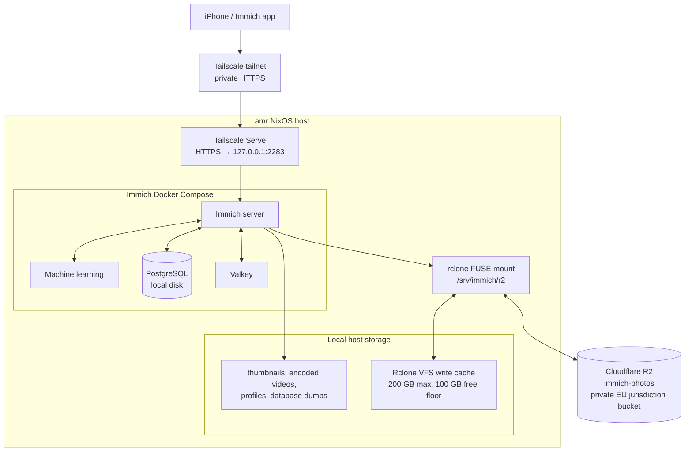

# Immich architecture

The `amr` NixOS workstation runs a private Immich instance for iPhone photo
backup and browsing. This document describes the deployed design; it does not
contain credentials or the tailnet's private hostname.

## Design goals

- Keep original photo and video assets in a private Cloudflare R2 bucket.
- Keep latency-sensitive state, including PostgreSQL, on the host filesystem.
- Expose Immich only to authenticated Tailscale devices.
- Make service ordering explicit so Immich cannot write to an unmounted R2
  path.
- Keep credentials encrypted in this repository and materialize them only at
  activation time.



## Storage layout

| Data | Location | Notes |
| --- | --- | --- |
| Original uploaded assets | `immich-photos` R2 bucket | Private R2 Standard bucket. With Immich's default Storage Template configuration, mobile uploads are in `upload/<user-id>/`. |
| R2 filesystem interface | `/srv/immich/r2` | Root-owned rclone FUSE mount. Immich binds its `upload/` and `library/` paths from here. |
| Temporary original-file cache | `/srv/immich/rclone-cache` | rclone VFS write cache. It is bounded to 200 GB, keeps 100 GB host free, and expires successful files after one hour. It is not an independent backup. |
| Database | `/srv/immich/postgres` | PostgreSQL data remains on local disk; it is never placed behind rclone/R2. |
| Generated media and application data | `/srv/immich/local` | Thumbnails, encoded videos, profiles, Immich database dumps, and ML model cache are local. Originals are not deliberately retained here after the rclone cache expires. |

Cloudflare R2 is configured as a private EU-jurisdiction bucket. The account
token is limited to object read/write for this bucket. The endpoint, access key,
secret, and bucket name are in the encrypted `secrets/immich-r2.env` file and
are materialized by sops-nix at `/run/secrets/immich-r2.env`; there is no
persistent `rclone.conf`.

## Services and availability

`immich-r2-mount.service` starts rclone after the network is online. The
`immich.service` systemd unit requires and binds to that mount, checks that the
mount point is active before starting Docker Compose, and is restarted when the
mount service restarts. This prevents Immich from accidentally writing into an
ordinary local directory if the FUSE mount disappears.

Docker Compose runs four containers: Immich server, Immich machine learning,
PostgreSQL, and Valkey. Docker restart policies are deliberately disabled;
systemd owns their lifecycle so mount ordering is preserved.

The Immich server listens only on `127.0.0.1:2283`. `tailscale serve` provides
HTTPS only within the authenticated tailnet and proxies to that listener.
Tailscale Funnel is not enabled, and PostgreSQL and Valkey have no host ports.
The Serve unit remains configured during a brief Immich restart, so R2 mount
recovery restores the backend without removing the tailnet endpoint.

## Secrets and operations

The PostgreSQL password is a sops-managed secret exposed to Compose as a file
secret; it is not put in the Compose environment. The R2 dotenv file has
mode `0400` at runtime. Never add decrypted secret files, rclone configuration,
or Cloudflare credentials to Git.

Apply configuration only after reviewing it:

```sh
make HOST=amr build
make HOST=amr apply
```

## Manual PostgreSQL backup and recovery

R2 contains the primary originals. PostgreSQL contains their paths, user and
album data, metadata, and the rest of Immich's application state, so it must be
backed up separately. The commands below store a compressed SQL dump and a
SHA-256 checksum in `backups/postgres/` in the same private R2 bucket. This is
adequate for recovery from loss of this host, but it is not independent
protection against loss of the R2 account or bucket.

Do not run a recovery restore during a normal backup. Restore is a
deliberate, destructive disaster-recovery operation.

### Create and verify a dump

Run this as the `amr` user. It does not stop Immich or delete data. For a
live deployment, take the database dump first; the R2 bucket will then contain
at least the originals referenced by it. Before a planned full recovery test,
pause phone uploads and wait for the rclone VFS write cache to finish flushing.

```sh
backup_dir=/srv/immich/local/backups/manual
backup_stamp=$(date -u +%Y%m%dT%H%M%SZ)
backup_file="$backup_dir/immich-postgres-$backup_stamp.sql.gz"

install -d -m 0700 "$backup_dir"
docker exec immich_postgres pg_dump --clean --if-exists \
  --username=postgres --dbname=immich \
  | gzip -n > "$backup_file"
gzip -t "$backup_file"
sha256sum "$backup_file" > "$backup_file.sha256"
chmod 600 "$backup_file" "$backup_file.sha256"
```

The command intentionally does not allocate a TTY, which would corrupt a
compressed dump stream.

### Upload to R2

The project shell loads the SOPS-materialized R2 credentials from
`/run/secrets/immich-r2.env`; do not place credentials on the command line.
Replace `<timestamp>` with the value used in the dump filename.

```sh
backup_file=/srv/immich/local/backups/manual/immich-postgres-<timestamp>.sql.gz
backup_name=$(basename "$backup_file")
r2_prefix=backups/postgres

nix-shell /home/amr/Documents/projects/private/immich/shell.nix --run \
  "rclone copyto '$backup_file' 'r2:immich-photos/$r2_prefix/$backup_name'"
nix-shell /home/amr/Documents/projects/private/immich/shell.nix --run \
  "rclone copyto '$backup_file.sha256' 'r2:immich-photos/$r2_prefix/$backup_name.sha256'"
```

### Download and verify from R2

On the recovery host, obtain the encrypted NixOS configuration and its SOPS age
key first, then activate only enough configuration for the R2 credentials and
`rclone` to be available. Download the dump before starting the restore.

```sh
restore_dir=/var/tmp/immich-restore
backup_name=immich-postgres-<timestamp>.sql.gz
r2_prefix=backups/postgres

install -d -m 0700 "$restore_dir"
nix-shell /home/amr/Documents/projects/private/immich/shell.nix --run \
  "rclone copyto 'r2:immich-photos/$r2_prefix/$backup_name' '$restore_dir/$backup_name'"
nix-shell /home/amr/Documents/projects/private/immich/shell.nix --run \
  "rclone copyto 'r2:immich-photos/$r2_prefix/$backup_name.sha256' '$restore_dir/$backup_name.sha256'"
(cd "$restore_dir" && sha256sum -c "$backup_name.sha256")
gzip -t "$restore_dir/$backup_name"
```

### Restore to a fresh Immich database

This procedure is for a newly provisioned host, where `/srv/immich/r2` already
mounts the original R2 bucket and `/srv/immich/postgres` is a fresh, empty
PostgreSQL data directory. Do **not** apply it to an existing database without
an explicit reset/rollback plan: the restore replaces database state.

```sh
restore_file=/var/tmp/immich-restore/immich-postgres-<timestamp>.sql.gz

sudo systemctl stop immich.service
docker compose --project-directory /etc/immich --env-file /etc/immich/immich.env create
docker start immich_postgres

until docker exec immich_postgres pg_isready --username=postgres --dbname=immich; do
  sleep 1
done

gunzip --stdout "$restore_file" \
  | sed "s/SELECT pg_catalog.set_config('search_path', '', false);/SELECT pg_catalog.set_config('search_path', 'public, pg_catalog', true);/g" \
  | docker exec -i immich_postgres psql --username=postgres --dbname=immich \
      --single-transaction --set ON_ERROR_STOP=on

sudo systemctl start immich.service
```

After the stack is healthy, confirm that R2-backed originals open in Immich.
Thumbnails and encoded videos can be regenerated. Preserve
`/srv/immich/local/profile` separately if profile images matter.

Keep the NixOS configuration repository, SOPS-encrypted secret files, and the
SOPS age key outside the destroyed host as well. Do not use Immich's **Free Up
Space** feature or delete Apple Photos/iCloud originals as part of this
deployment.
