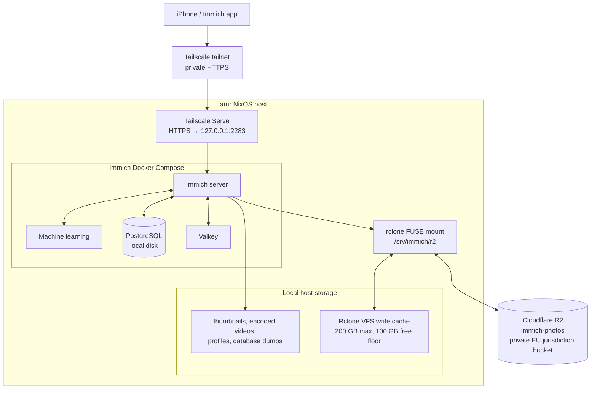

# Immich architecture

The `amr` NixOS workstation runs a private Immich instance for iPhone photo
backup and browsing. This document describes the deployed design; it does not
contain credentials or the tailnet's private hostname.

## Design goals

- Keep original photo and video assets in a private Cloudflare R2 bucket.
- Keep latency-sensitive state, including PostgreSQL, on the host filesystem.
- Expose Immich only to authenticated Tailscale devices.
- Make service ordering explicit so Immich cannot write to an unmounted R2
  path.
- Keep credentials encrypted in this repository and materialize them only at
  activation time.



## Storage layout

| Data                                 | Location                   | Notes                                                                                                                                                                   |
| ------------------------------------ | -------------------------- | ----------------------------------------------------------------------------------------------------------------------------------------------------------------------- |
| Original uploaded assets             | `immich-photos` R2 bucket  | Private R2 Standard bucket. With Immich's default Storage Template configuration, mobile uploads are in `upload/<user-id>/`.                                            |
| R2 filesystem interface              | `/srv/immich/r2`           | Root-owned rclone FUSE mount. Immich binds its `upload/` and `library/` paths from here.                                                                                |
| Temporary original-file cache        | `/srv/immich/rclone-cache` | rclone VFS write cache. It is bounded to 200 GB, keeps 100 GB host free, and expires successful files after one hour. It is not an independent backup.                  |
| Database                             | `/srv/immich/postgres`     | PostgreSQL data remains on local disk; it is never placed behind rclone/R2.                                                                                             |
| Generated media and application data | `/srv/immich/local`        | Thumbnails, encoded videos, profiles, Immich database dumps, and ML model cache are local. Originals are not deliberately retained here after the rclone cache expires. |

Cloudflare R2 is configured as a private EU-jurisdiction bucket. The account
token is limited to object read/write for this bucket. The endpoint, access key,
secret, and bucket name are in the encrypted `secrets/immich-r2.env` file and
are materialized by sops-nix at `/run/secrets/immich-r2.env`; there is no
persistent `rclone.conf`.

## Services and availability

`immich-r2-mount.service` starts rclone after the network is online. The
`immich.service` systemd unit requires and binds to that mount, checks that the
mount point is active before starting Docker Compose, and is restarted when the
mount service restarts. This prevents Immich from accidentally writing into an
ordinary local directory if the FUSE mount disappears.

Docker Compose runs four containers: Immich server, Immich machine learning,
PostgreSQL, and Valkey. Docker restart policies are deliberately disabled;
systemd owns their lifecycle so mount ordering is preserved.

The Immich server listens only on `127.0.0.1:2283`. `tailscale serve` provides
HTTPS only within the authenticated tailnet and proxies to that listener.
Tailscale Funnel is not enabled, and PostgreSQL and Valkey have no host ports.
The Serve unit remains configured during a brief Immich restart, so R2 mount
recovery restores the backend without removing the tailnet endpoint.

## Secrets and operations

The PostgreSQL password is a sops-managed secret exposed to Compose as a file
secret; it is not put in the Compose environment. The R2 dotenv file has
mode `0400` at runtime. Never add decrypted secret files, rclone configuration,
or Cloudflare credentials to Git.

Apply configuration only after reviewing it:

```sh
make HOST=amr build
make HOST=amr apply
```

## Scheduled PostgreSQL backup and recovery

R2 contains the primary originals. PostgreSQL contains their paths, user and
album data, metadata, and the rest of Immich's application state, so it must be
backed up separately. Immich's built-in **Create Database Dump** job creates
compressed PostgreSQL dumps in `/srv/immich/local/backups/`. Configure its
schedule and local retention in **Administration -> Settings -> Backup**. A
weekly schedule creates files such as
`immich-db-backup-20261006T020000-v3.2.4-pg14.19.sql.gz`.

The local retention policy is not an off-host backup. Copy the generated dumps
to `backups/postgres/` in the private R2 bucket after each run. This protects
against loss of this host, but it is not independent protection against loss of
the R2 account or bucket.

### Verify and copy generated dumps to R2

Run this as the `amr` user after the scheduled backup completes. The repository
`shell.nix` reads the SOPS-materialized credentials at runtime and creates the
temporary `r2` rclone remote without writing a persistent configuration.

```sh
backup_dir=/srv/immich/local/backups
latest_backup=$(find "$backup_dir" -maxdepth 1 -type f -name 'immich-db-backup-*.sql.gz' \
  -printf '%T@ %p\n' | sort -n | tail -1 | cut -d' ' -f2-)

gzip -t "$latest_backup"
ls -lh "$latest_backup"

nix-shell --run "rclone copy '$backup_dir' 'r2:immich-photos/backups/postgres' \
  --include 'immich-db-backup-*.sql.gz'"
```

`rclone copy` never removes old remote dumps. Periodically review the R2
retention separately; do not use `rclone sync` for backups unless deletion has
been explicitly designed and tested.

### Recover on a fresh host

Obtain the NixOS configuration repository and SOPS age key, then provision the
same Immich/R2 configuration on the replacement host. With a fresh,
uninitialized Immich database, download the chosen dump into the directory
where Immich expects it:

```sh
backup_name=immich-db-backup-<timestamp>-v<immich-version>-pg<postgres-version>.sql.gz
backup_dir=/srv/immich/local/backups

sudo install -d -m 0750 -o amr -g amr "$backup_dir"
nix-shell --run "rclone copyto 'r2:immich-photos/backups/postgres/$backup_name' \
  '$backup_dir/$backup_name'"
gzip -t "$backup_dir/$backup_name"
```

Start Immich and select **Restore from backup** during onboarding. It will see
the dump in `/data/backups`; use the normal onboarding integrity checks to
confirm the R2-backed `upload/` and `library/` paths are readable. For an
already initialized instance, use **Administration -> Maintenance -> Restore
database backup** instead. A restore replaces the current database, so it is a
deliberate disaster-recovery operation, never a normal backup task.

After the stack is healthy, confirm that R2-backed originals open in Immich.
Thumbnails and encoded videos can be regenerated. Preserve
`/srv/immich/local/profile` separately if profile images matter.

Keep the NixOS configuration repository, SOPS-encrypted secret files, and the
SOPS age key outside the destroyed host as well. Do not use Immich's **Free Up
Space** feature or delete Apple Photos/iCloud originals as part of this
deployment.
